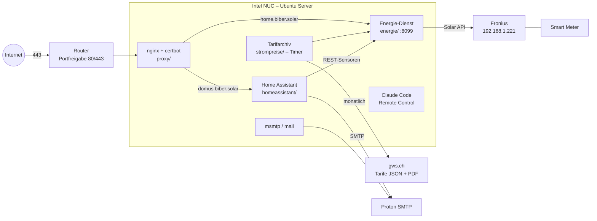

# Projektdokumentation Domus

Stand: 27. September 2026

Domus ist ein Home-System für ein Haus in Stäfa. Es läuft auf einem kleinen Intel NUC mit Ubuntu Server und
bündelt Hausautomation, Photovoltaik-Monitoring, Strompreise und Benachrichtigungen an einem Ort. Die gesamte
Konfiguration liegt versioniert im Git-Repository `patbiber/domus`; Geheimnisse und Betriebsdaten bleiben lokal.

---

## 1. Ziele

- **Ein zentrales System** für das Haus statt vieler Hersteller-Apps: Home Assistant als Herzstück.
- **Energie verstehen:** Was produziert die Solaranlage, was verbraucht das Haus, was kostet oder bringt das gerade?
- **Nachvollziehbar und reproduzierbar:** Jeder Dienst in einem eigenen Ordner mit eigener `compose.yml`,
  jede Änderung als Git-Commit mit deutscher Commit-Message.
- **Sicher:** Keine Secrets im Repo, keine Portfreigaben ohne bewusste Entscheidung, Backups vor jeder Änderung
  an Home Assistant.

## 2. Hardware und Grundsystem

| Komponente | Details |
|---|---|
| Rechner | Intel NUC, Intel Core i3-4010U, 7 GB RAM |
| Betriebssystem | Ubuntu Server 26.04 LTS |
| Container | Docker mit Docker Compose |
| Zeitzone | `Europe/Zurich` |
| DNS | Cloudflare `1.1.1.1` / `1.0.0.1` (per Netplan statt Router) |
| Netzwerk | `eno1` mit DHCP-Adresse und zusätzlicher statischer IP `192.168.1.23/24` |

### Geräte im Haus

| Gerät | Adresse | Anbindung |
|---|---|---|
| Fronius-Wechselrichter (Datamanager, Solar API v1) | `192.168.1.221` | HTTP, nur tagsüber erreichbar |
| Fronius Smart Meter TS 65A-3 | über den Wechselrichter | Einbauort Verbrauchszweig (`Meter_Location: load`) |

## 3. Architektur



### Dienste

| Ordner | Dienst | Art | Erreichbar |
|---|---|---|---|
| `homeassistant/` | Home Assistant (stable) | Docker, `network_mode: host` | https://domus.biber.solar |
| `proxy/` | nginx + certbot (Let's Encrypt) | Docker | Ports 80/443 |
| `energie/` | Energie-API und Retro-Webseite | Docker (`python:3.13-alpine`), `network_mode: host` | https://home.biber.solar, LAN-Port 8099 |
| `strompreise/` | Monatliches Archiv der GWS-Stromtarife | Bash-Skript + systemd-User-Timer | – |
| `claude-remote/` | Dauerhafte Claude-Code-Session mit Remote Control | systemd-User-Dienst in tmux | claude.ai/code, Claude-App |
| (Host) | E-Mail-Versand | `msmtp`, `msmtp-mta`, `bsd-mailx` | – |

Geplant: `mosquitto/` (MQTT), `zigbee2mqtt/` (Zigbee-Stick folgt), Philips Hue über die Hue Bridge.

## 4. Komponenten im Detail

### 4.1 Home Assistant

- Container `ghcr.io/home-assistant/home-assistant:stable`, Konfiguration in `homeassistant/config/`
  (per `.gitignore` ausgeschlossen).
- Zugriff von aussen über nginx; Proxy-Einstellungen (`use_x_forwarded_for`, `trusted_proxies`, IP-Sperre nach
  5 Fehlversuchen) liegen seit 2026 in `config/.storage/http`.
- 2-Faktor-Login (TOTP) für alle Benutzer.
- **SMTP-Benachrichtigungen:** Integration „domus_mail“, Entität `notify.domus_mail_patrick_biber_solar`,
  Absender `domus@biber.solar` über Proton SMTP.
- **Energie-Sensoren** (per `rest` vom Energie-Dienst):

  | Entität | Einheit | Bedeutung |
  |---|---|---|
  | `sensor.strompreis_bezug` | CHF/kWh | aktueller Bezugspreis inkl. MWST |
  | `sensor.ruckliefervergutung` | CHF/kWh | aktuelle Rückliefervergütung (Sommer/Winter) |
  | `sensor.stromkosten_aktuell` | CHF/h | was der Netzbezug gerade kostet |
  | `sensor.einspeiseerlos_aktuell` | CHF/h | was die Einspeisung gerade bringt |
  | `sensor.borsenpreis_day_ahead` | Rp/kWh | Day-Ahead-Börsenpreis Schweiz (EPEX Spot) |
  | `binary_sensor.borsenpreis_negativ` | – | an, wenn der Börsenpreis gerade negativ ist |
  | `sensor.borsenpreise_prognose` | Rp/kWh | tiefster kommender Preis, alle Stundenwerte als Attribut |
  | `sensor.borsenpreis_day_ahead_chf` | CHF/kWh | Börsenpreis für den Vergleich mit den GWS-Tarifen |

- **Dashboard „Energie & Börse“** (`/energie-boerse`): Energie-Karten plus Börsenpreise, Verlauf Börse vs. GWS
  und Tabelle der kommenden Stunden. Das eingebaute Energie-Dashboard lässt sich nicht um eigene Karten erweitern.

### 4.2 Reverse Proxy und Zertifikate (`proxy/`)

- nginx terminiert TLS für `domus.biber.solar` (Home Assistant, WebSockets) und `home.biber.solar` (Energie-Seite).
- Unbekannte Hostnamen und direkte IP-Zugriffe werden verworfen (`return 444`).
- certbot prüft alle 12 h die Erneuerung, nginx lädt alle 6 h neu.
- `home.biber.solar`: Passwortschutz (Basic Auth), nur GET/HEAD, Rate-Limit, strenge Content-Security-Policy.

### 4.3 Tarifarchiv GWS (`strompreise/`)

- `fetch-tarife.sh` lädt jeden Monatsersten um 06:17 (systemd-Timer, verpasste Läufe werden nachgeholt) von
  https://gws.ch/strom-tarife-produkte/ die maschinenlesbaren Tarife (`tarife.json`) und alle Tarif-PDFs.
- Ablage in `strompreise/data/<Datum>/` mit `SHA256SUMS` und `quellen.txt`; `data/latest` zeigt auf den neuesten Stand.
- Bei geänderten Dateien oder Fehlern kommt eine E-Mail.

### 4.4 Energie-Dienst (`energie/`)

- `server.py` (nur Python-Standardbibliothek) fragt alle 5 s den Fronius ab (`GetPowerFlowRealtimeData`).
- Der Strompreis wird aus `tarife.json` (Produkt ÖkoStrom + Netztarif) und `energie/tarif.json` berechnet
  (Gemeindeabgabe, MWST, Rückliefervergütung, Korrekturen gemäss PDF). Nachgerechnet gegen die GWS-PDFs:
  26.68 Rp/kWh (2026) bzw. 24.65 Rp/kWh (2027) inkl. MWST.
- Endpunkte: `/api/status` (live), `/api/history` (Minutenwerte der letzten 24 h, nur im Speicher),
  `/api/boerse` (Day-Ahead-Börsenpreise CH von Energy-Charts, in Rp/kWh zum EZB-Kurs),
  `/api/speicher` (Speicher-Simulation: 2, 5 und 10 kWh virtuell mit echten Netzwerten, Ersparnis in CHF),
  `/api/archiv` (10-Minuten-Archiv, 5 Jahre, ~5 MB) mit der Logbuch-Ansicht `logbuch.html`.
- Die Webseite heisst intern **homi**.
- Der Wechselrichter läuft im Nachtmodus und liefert rund um die Uhr Werte; fällt er aus, meldet die API `fronius_ok: false`.

### 4.5 Retro-Webseite https://home.biber.solar

Eine Live-Ansicht im Stil der klassischen SCUMM-Adventures der 80er-Jahre:

- Haus im Querschnitt mit Solarziegeln, Stromleitung zum Gebäude der Gemeindewerke Stäfa.
- Eine Figur mit Hut läuft zwischen Geräten umher; die Geräte werden zufällig so gewürfelt, dass ihre Summe dem
  aktuellen Smart-Meter-Verbrauch entspricht („Standby-Gespenster“ füllen den Rest).
- Stromfunken auf der Leitung, ein rückwärts drehender Ferraris-Zähler, Münzen zwischen Sparschwein und GWS.
- Börsenticker mit Day-Ahead-Preisen für heute/morgen; bei negativen Preisen schwitzt das GWS-Gebäude.
- Klickbare Verb-Leiste („Schalte aus“, „Lies“, „Nimm“ …), Kassenbuch mit Leistung und CHF/h, 24-h-Diagramme.
- Eine einzige Datei (`energie/www/index.html`), ohne externe Ressourcen.

### 4.6 E-Mail-Versand

- Host: `msmtp` als `sendmail`, `mail` aus `bsd-mailx`; Konfiguration in `/etc/msmtprc` (`root:msmtp`, `640`),
  `msmtp` setgid `msmtp` – jeder Benutzer kann senden, niemand das Passwort lesen.
- `/etc/aliases` leitet `root` und alle lokalen Empfänger an `patrick@biber.solar`.

### 4.7 Claude Code Remote Control (`claude-remote/`)

- Dauerhafte Claude-Code-Session als systemd-User-Dienst (tmux, Linger aktiv), steuerbar über claude.ai/code
  oder die Claude-App.
- Arbeitsregeln in `CLAUDE.md`: deutsch antworten und committen, keine Secrets, keine Portfreigaben ohne
  Rückfrage, keine Datenträger formatieren, Backup vor Änderungen an Home Assistant.
- Befehle werden standardmässig in der App bestätigt (`--permission-mode default`).

## 5. Sicherheit und Datenschutz

| Thema | Umsetzung |
|---|---|
| Secrets | Nur `.env.example` im Repo; `.env`, `secrets.yaml`, `/etc/msmtprc` bleiben lokal |
| Betriebsdaten | `homeassistant/config/`, `strompreise/data/`, `energie/data/`, `backups/` per `.gitignore` ausgeschlossen |
| Updates | Ubuntu und Docker CE täglich, Neustart nur wenn nötig um 03:30; Container-Images wöchentlich mit HA-Backup, Prüfung und automatischem Zurückrollen; Mail-Bericht |
| Aufbewahrung | Container-Logs max. 3 × 10 MB, keine Protokollierung der laufenden API-Abrufe, HA-Backups: letzte 10 |
| Öffentliche Ports | Nur 80/443 (Router → NUC); Port 8099 nur im LAN |
| Home Assistant | TLS, IP-Sperre, 2-Faktor-Login |
| Energie-Seite | Passwortschutz (Basic Auth), nur lesend, Rate-Limit, CSP |

## 6. Betrieb

```bash
# Dienst starten / aktualisieren (vorher Backup bei Home Assistant!)
cd <dienst> && docker compose pull && docker compose up -d

# Backup Home Assistant
~/domus/homeassistant/backup.sh   # behält die letzten 10

# Tarife sofort abrufen, Timer ansehen
systemctl --user start strompreise.service
systemctl --user list-timers

# Energie-API prüfen
curl -s http://127.0.0.1:8099/api/status | jq

# Mailversand testen
echo "Test" | mail -s "Test" patrick@biber.solar
```

Details zu Einrichtung und Wiederherstellung stehen im [README](../README.md).

## 7. Projektverlauf

| Datum | Meilenstein |
|---|---|
| 26.09.2026 | Grundstruktur, Home Assistant, DNS, Zeitzone, Netzwerk |
| 26.09.2026 | nginx + Let's Encrypt, https://domus.biber.solar |
| 26.09.2026 | Claude Code Remote Control als dauerhafter Dienst |
| 27.09.2026 | Fronius-Wechselrichter und Smart Meter gefunden und dokumentiert |
| 27.09.2026 | E-Mail-Versand über Proton SMTP (Home Assistant und Host) |
| 27.09.2026 | Monatliches Archiv der GWS-Stromtarife |
| 27.09.2026 | Energie-Dienst, Strompreis-Sensoren, Retro-Webseite https://home.biber.solar |
| 28.09.2026 | Fronius-Integration und Energie-Dashboard mit GWS-Tarifen |
| 29.09.2026 | Day-Ahead-Börsenpreise in Home Assistant und auf home.biber.solar, Dashboard „Energie & Börse“ |
| 30.09.2026 | Nachtmodus am Wechselrichter, Nachtansicht und Passwortschutz für home.biber.solar |
| 30.09.2026 | Speicher-Simulation (2/5/10 kWh) in Energie-Dienst und Home Assistant |
| 01.10.2026 | Log-Rotation, Backup-Rotation, 10-Minuten-Archiv (5 Jahre) und Logbuch in homi |
| 01.10.2026 | Automatische OS- und Docker-Image-Updates mit Prüfung und Zurückrollen, Neustart-Bericht |
| 02.10.2026 | Testseite https://test.biber.solar aus github.com/patbiber/biber-solar im eigenen Container |

## 8. Offene Punkte

- Rückliefervergütung 2027 nachtragen, sobald die GWS sie veröffentlichen (`energie/tarif.json`).
- MQTT, Zigbee2MQTT und Hue einbinden.
- LAN-Adresse im README prüfen (dort steht `192.168.178.121`, der NUC meldet `192.168.1.x`).
