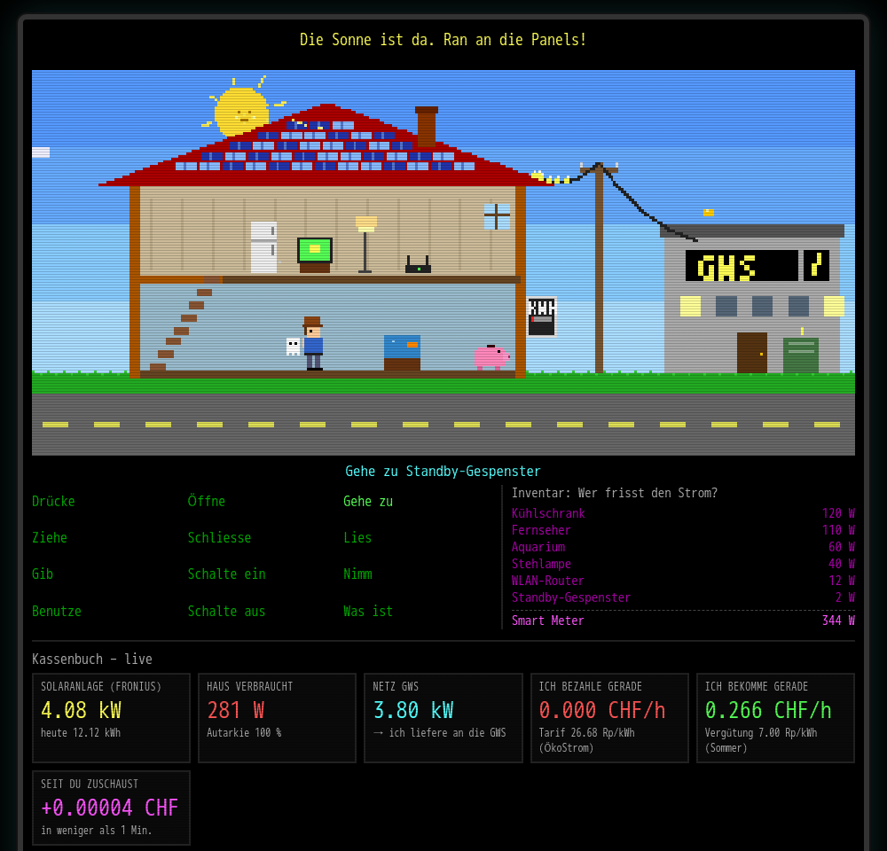

# Unser Haus als Retro-Adventure: So sieht man bei uns, was die Sonne gerade bringt

Wer in den 80ern vor einem Commodore 64 oder Amiga sass, kennt sie noch: die Adventures mit der Verb-Leiste am unteren Bildschirmrand. „Gehe zu“, „Nimm“, „Benutze“ – und dann klickte man sich durch skurrile Häuser voller merkwürdiger Gegenstände. Genau so kann man jetzt bei uns zu Hause zuschauen, was unsere Solaranlage gerade leistet.

**Live ansehen: [home.biber.solar](https://home.biber.solar)**

## Was man sieht

Das Haus ist aufgeschnitten wie ein Puppenhaus. Auf dem Dach glitzern die Solarziegel, und je mehr die Sonne liefert, desto stärker funkeln sie. Eine kleine Figur mit Hut läuft durchs Haus, steigt die Treppe hoch und runter und kommentiert, was gerade passiert.

Die Zahlen dahinter sind echt und kommen live von unserem Fronius-Wechselrichter:

- **Solaranlage:** wie viel Leistung die Panels gerade erzeugen und wie viele Kilowattstunden es heute schon sind.
- **Haus:** wie viel Strom wir gerade verbrauchen, gemessen vom Smart Meter.
- **Netz:** ob wir gerade Strom von den Gemeindewerken Stäfa beziehen oder Strom ins Netz liefern.
- **Kassenbuch:** was uns das in diesem Moment kostet oder einbringt, in Franken pro Stunde.

## Die Geräte sind erfunden, der Verbrauch nicht

Welche Geräte im Haus stehen, würfelt die Seite zufällig aus. Die Summe stimmt aber immer genau mit dem Smart Meter überein. Ziehen wir 344 Watt, stehen im Haus vielleicht ein Kühlschrank, ein Fernseher, ein Aquarium, eine Stehlampe und der WLAN-Router. Und für die letzten paar Watt, die sich keinem Gerät zuordnen lassen, schweben die „Standby-Gespenster“ durchs Wohnzimmer. Mit etwas Glück taucht auch mal ein elektrischer Kazoo oder ein Alien-Detektor auf.

Man kann auch selbst mitspielen: Verb anklicken, dann ein Gerät. „Schalte aus“ beim Toaster? „Geht nicht. Toaster ist Teil des Messwerts. Physik!“

## Geld fliesst sichtbar

Am schönsten ist es an sonnigen Tagen. Dann laufen gelbe Funken über die Stromleitung zum Gebäude der Gemeindewerke, der alte Stromzähler an der Hauswand dreht rückwärts, und Münzen fliegen von den Gemeindewerken direkt ins Sparschwein – mit einem zufriedenen „OINK“. Beziehen wir Strom, fliegen die Münzen in die andere Richtung.

Die Preise sind die echten Tarife der Gemeindewerke Stäfa: aktuell 26.68 Rappen pro Kilowattstunde für den Bezug (ÖkoStrom, inkl. MWST) und 7 Rappen Rückliefervergütung im Sommer, 15 Rappen im Winter. Die Tarife lädt unser System jeden Monat automatisch von der Webseite der GWS und meldet sich per E-Mail, wenn sich etwas ändert. Für 2027 hat die GWS bereits eine Senkung angekündigt – das Haus rechnet ab Januar automatisch mit den neuen Preisen.

Ein kleiner Zähler zeigt übrigens, wie viel Geld seit dem Öffnen der Seite verdient wurde. Es sind meist nur Bruchteile von Rappen, aber es ist erstaunlich befriedigend, ihnen beim Wachsen zuzuschauen.

## Nachts schläft alles

Unser Wechselrichter schaltet sich nachts ab – und damit auch die Livedaten. Die Seite nimmt es gelassen: Mond und Sterne gehen auf, und die Figur schläft mit einem „Zzz“ über dem Kopf. Am Morgen, sobald die Sonne auf die Panels scheint, wacht alles wieder auf.

## Was dahintersteckt

Hinter der Seite läuft unser Home-System „Domus“ auf einem kleinen Intel NUC im Haus. Darauf laufen Home Assistant, ein kleiner Dienst, der den Wechselrichter abfragt und die Strompreise berechnet, und ein Webserver mit Let's-Encrypt-Zertifikat. Die ganze Konfiguration ist versioniert, Passwörter und Messdaten bleiben lokal.

Gebaut habe ich das an einem Wochenende zusammen mit Claude Code, einem KI-Assistenten, der direkt auf dem NUC arbeitet. Meine Wünsche formulierte ich einfach auf Deutsch, und Claude hat den Wechselrichter im Netz gesucht, die Tarife der GWS ausgewertet, den Dienst programmiert und die Pixel-Grafik gezeichnet. Die Seite besteht aus einer einzigen HTML-Datei, ganz ohne externe Bibliotheken.

Viel Spass beim Zuschauen – und falls die Sonne scheint: Hört ihr das Sparschwein?

**[home.biber.solar](https://home.biber.solar)**
